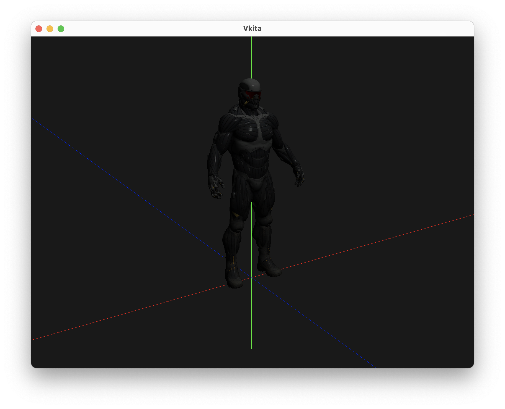
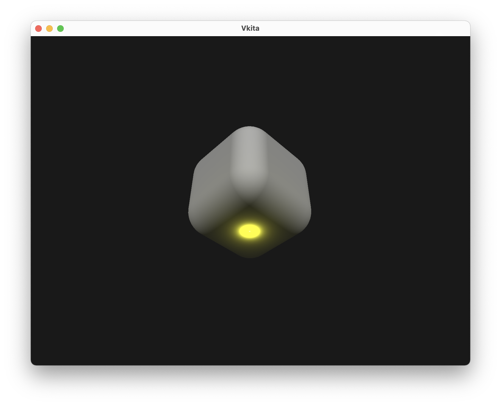
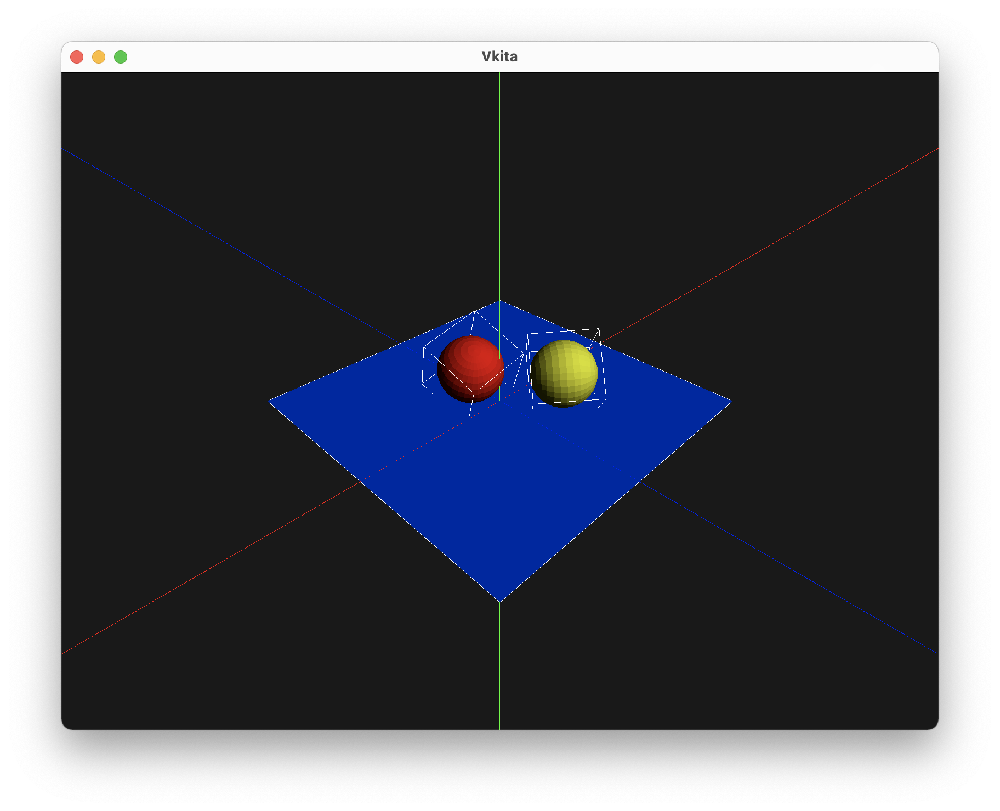

# Vkita
A vulkan game engine for learning purpose.

## Dependencies
#### Vulkan
Download Vulkan-SDK from https://vulkan.lunarg.com/sdk/home and install.

## Get Started
#### MacOS
```
git clone --recursive https://github.com/LongerZrLong/Vkita.git
cd Vkita
mkdir build
cd build
cmake ..
make all
```

After build finishing, take a look at the `Test` directory in `build` directory. There should be some test executables that can be 
started in terminal. e.g.
```
cd Test
./EditorCameraTest
```

#### Linux and Windows
Although it is only tested on MacOS. The build and run process for Linux and Windows should be similar.

## Features

* **Vulkan C++ wrapper**: 
  * Wraps Vulkan objects such as Device, SwapChain, Buffer, Image, Descriptor, Pipeline, etc.
* **Scene system**: 
  * Support common 3D scene and model file format, e.g. obj, gltf.
  * Support scene graph data structure.
* **Material system**: 
  * Supports Blinn-Phong shading pipeline.
* **Light system**: 
  * Supports multiple light sources of different types: directional, point and spot.
* **Physics system**: 
  * Supports rigid body dynamics.

## Screenshots

### Scene Rendering


### Multiple Light Sources


### Basic Rigid Body Dynamics

